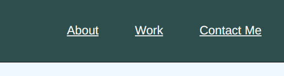
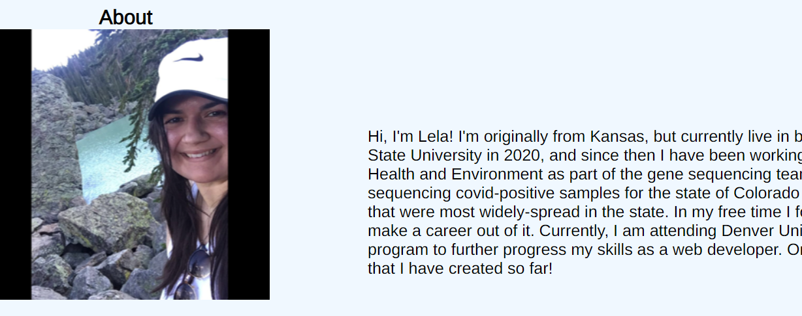
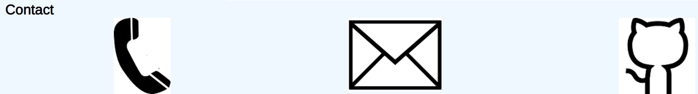

# LelaProfilePage

## Description

This project is a personal profile page which demonstrates my skills as a web developer to potential employers. To accomplish this, HTML and CSS concepts were added to create a page that can link to different pages, navigate to different sections within the page, and become responsive for various screens and devices.

## Installation

In order to install:

1. Open GitHub in your preferred browser and login to your account.

2. Navigate to the search bar and look up your desired repository.

3. Click the green "Code" button and copy either the "HTTPS" key or the "SSH" key to your clipboard.

4. Open your terminal and navigate to your preferred directory where you would like the project to be installed using 'cd'.

5. In GitHub click the green "Code" button and copy the HTTPS key to your clipboard

6. Use the 'git clone' command in GitBash and paste the copied HTTPS key.

7. Open your preferred code editor and open the "index.html" document in the "Develop" folder to view the HTML code. To open "style.css", navigate to Develop -> assets -> css -> style.css

8. To view the SEOHoriseonRefactor project in your browser, right-click on the "index.html" file and select "Open in Browser"

## Usage

1. Using this project will allow the user to view a personal profile page and interact with the site by navigating to different sections of the site, as well as being redirected to other pages when clicking on an image.

2. In order to edit and view the project, navigate to the installed repo directory and open your preferred code editor.

3. Open your preferred code editor, then open the "index.html" document in the "Develop" folder to view the HTML code. To open "style.css", navigate to Develop -> assets -> css -> style.css .

4. Right-click on the "index.html" tab at the top of your code editor, which takes you to view the website.

5. To navigate to different sections of the page, go to the top right corner and click "About", "Work", and "Contact Me" respectively.

6. In order to view the Horiseon project, simply click on the Horiseon image and you will be redirected to the live page.

## Credits

[Stack overflow](https://stackoverflow.com/)

[W3schools](https://www.w3schools.com/)

[MDN Web Docs](https://developer.mozilla.org/en-US/)

## License

MIT License

Copyright (c) [2022] [SEOHoriseonRefactor]

Permission is hereby granted, free of charge, to any person obtaining a copy
of this software and associated documentation files (the "Software"), to deal
in the Software without restriction, including without limitation the rights
to use, copy, modify, merge, publish, distribute, sublicense, and/or sell
copies of the Software, and to permit persons to whom the Software is
furnished to do so, subject to the following conditions:

The above copyright notice and this permission notice shall be included in all
copies or substantial portions of the Software.

THE SOFTWARE IS PROVIDED "AS IS", WITHOUT WARRANTY OF ANY KIND, EXPRESS OR
IMPLIED, INCLUDING BUT NOT LIMITED TO THE WARRANTIES OF MERCHANTABILITY,
FITNESS FOR A PARTICULAR PURPOSE AND NONINFRINGEMENT. IN NO EVENT SHALL THE
AUTHORS OR COPYRIGHT HOLDERS BE LIABLE FOR ANY CLAIM, DAMAGES OR OTHER
LIABILITY, WHETHER IN AN ACTION OF CONTRACT, TORT OR OTHERWISE, ARISING FROM,
OUT OF OR IN CONNECTION WITH THE SOFTWARE OR THE USE OR OTHER DEALINGS IN THE
SOFTWARE.
